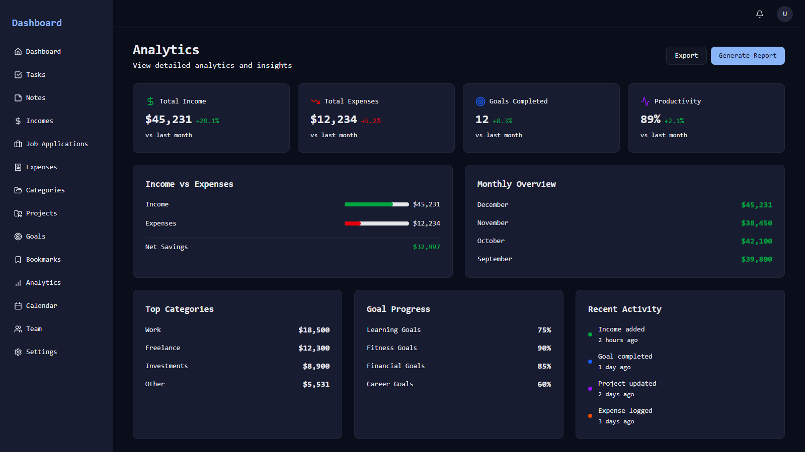
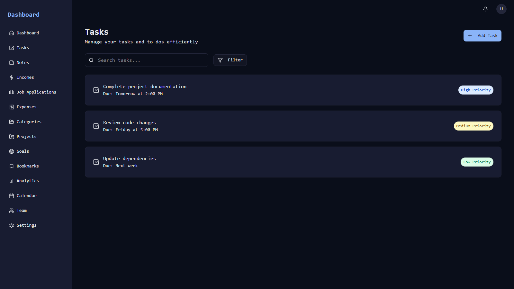
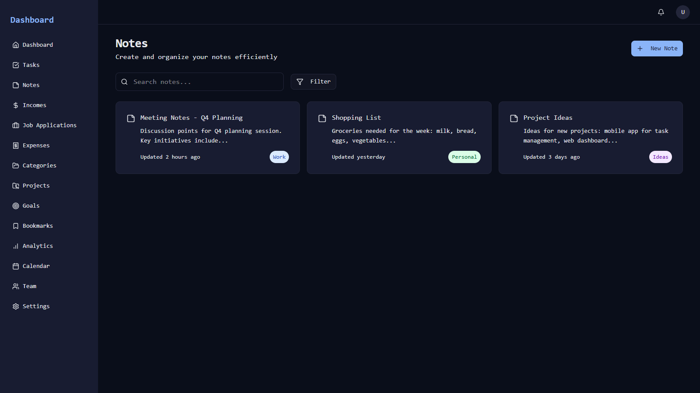
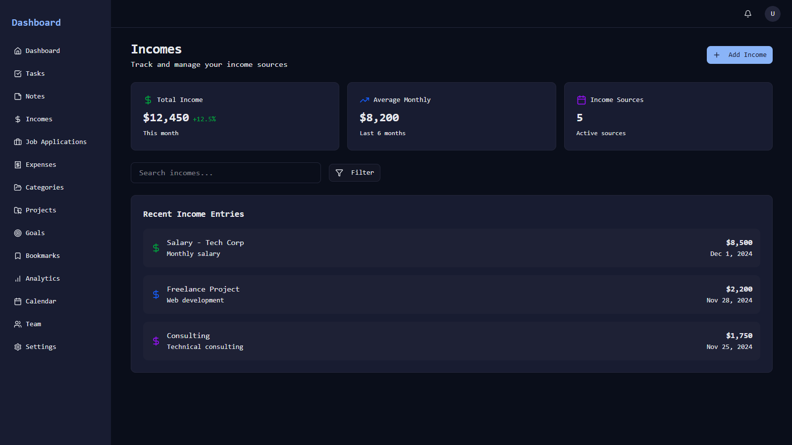
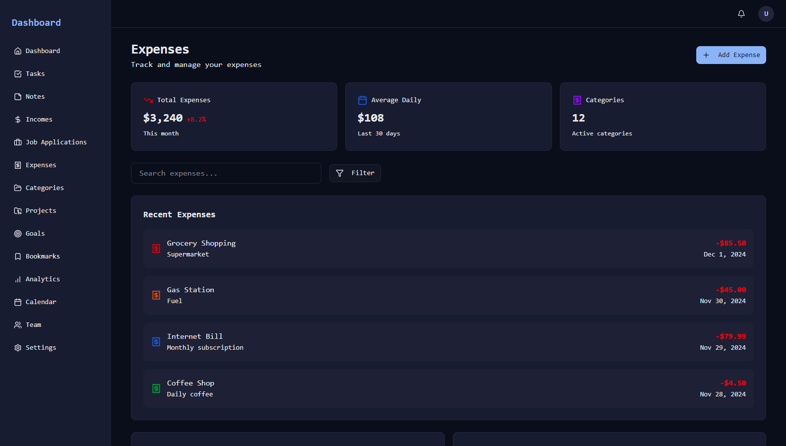
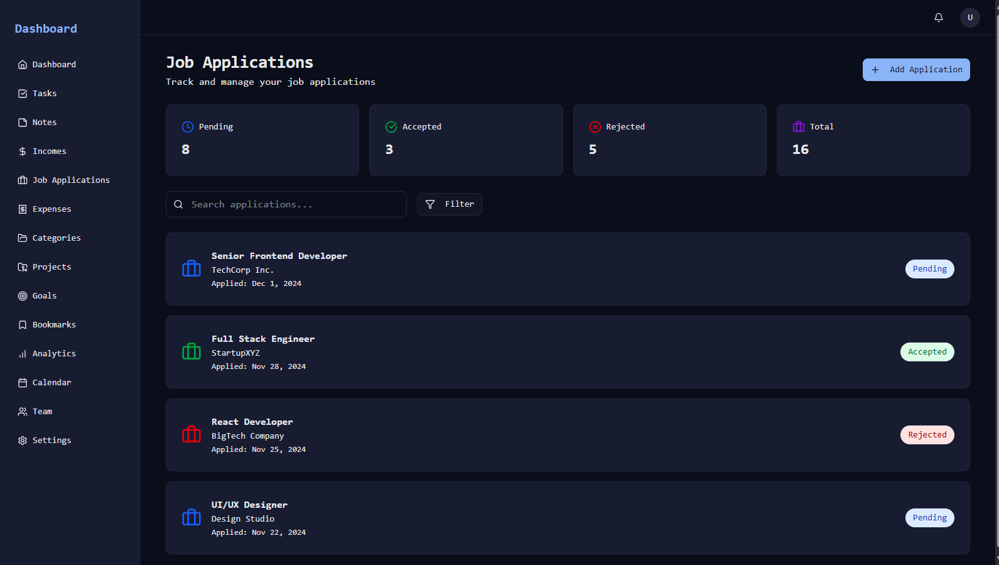
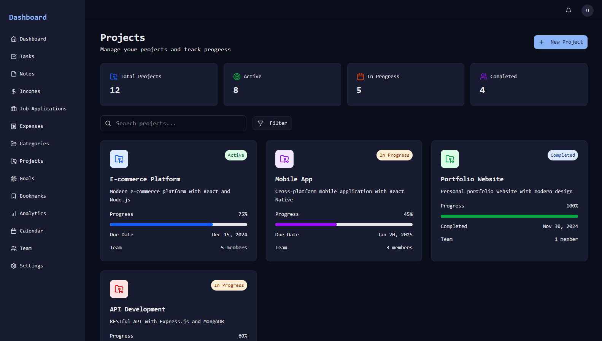

# Personal Dashboard

A modern, full-stack personal dashboard application built with Next.js, TypeScript, Tailwind CSS, shadcn/ui, and a Node.js/Express/Apollo Server backend with PostgreSQL. This dashboard helps you manage tasks, notes, incomes, expenses, job applications, projects, goals, bookmarks, and more—all in one place.

## Features

- **Dashboard Overview**: Quick stats and analytics for your productivity and finances
- **Tasks**: Manage your to-dos with priorities and due dates
- **Notes**: Create, organize, and search notes
- **Incomes & Expenses**: Track your income sources and expenses with categories
- **Job Applications**: Manage and monitor your job search
- **Projects**: Organize and track project progress
- **Goals**: Set, track, and visualize your goals
- **Bookmarks**: Save and categorize important links
- **Categories**: Organize items across modules
- **Analytics**: Visualize your data with charts and summaries
- **Responsive UI**: Works great on desktop and mobile
- **Dark Theme**: Beautiful, accessible dark mode by default
- **Authentication**: Secure user management (backend)

## Screenshots

Here are some screenshots showcasing the main features of the Personal Dashboard:

### Dashboard Analytics

*Overview of your productivity and finances, with charts and quick stats.*

### Tasks Management

*Organize your to-dos with priorities and due dates.*

### Notes

*Create, organize, and search your notes easily.*

### Incomes Tracking

*Track your income sources by category and date.*

### Expenses Tracking

*Monitor and categorize your expenses.*

### Job Applications

*Manage and monitor your job search and application progress.*

### Projects

*Organize and track your project progress and milestones.*

## Tech Stack

- **Frontend**: Next.js (App Router), TypeScript, Tailwind CSS, shadcn/ui, Lucide Icons
- **Backend**: Node.js, Express, Apollo Server (GraphQL), PostgreSQL
- **ORM**: Sequelize (or similar, see backend)
- **Styling**: Tailwind CSS, CSS variables, Roboto Mono font
- **Testing**: Postman collections, GraphQL playground

## Folder Structure

```
personal_dashboard_nextjs/         # Frontend (Next.js)
    src/
      app/                   # App routes and pages
      components/            # UI and layout components
      lib/                   # Utilities
      config/                # Configuration files (e.g., nav items)
    public/                  # Static assets
    ...
```

## Getting Started

### Frontend

```bash
cd personal_dashboard_nextjs
npm install
npm run dev
```
Visit [http://localhost:3000](http://localhost:3000)

## Customization
- Edit navigation in `src/config/nav-items.ts`
- Update theme/colors in `src/app/globals.css`
- Add new pages/components in `src/app/`

## Learn More
- [Next.js Documentation](https://nextjs.org/docs)
- [shadcn/ui](https://ui.shadcn.com/)
- [Apollo Server](https://www.apollographql.com/docs/apollo-server/)
- [Tailwind CSS](https://tailwindcss.com/)

---

_This project is a modern, extensible template for building your own personal productivity dashboard._

# personal_dashboard_nextjs